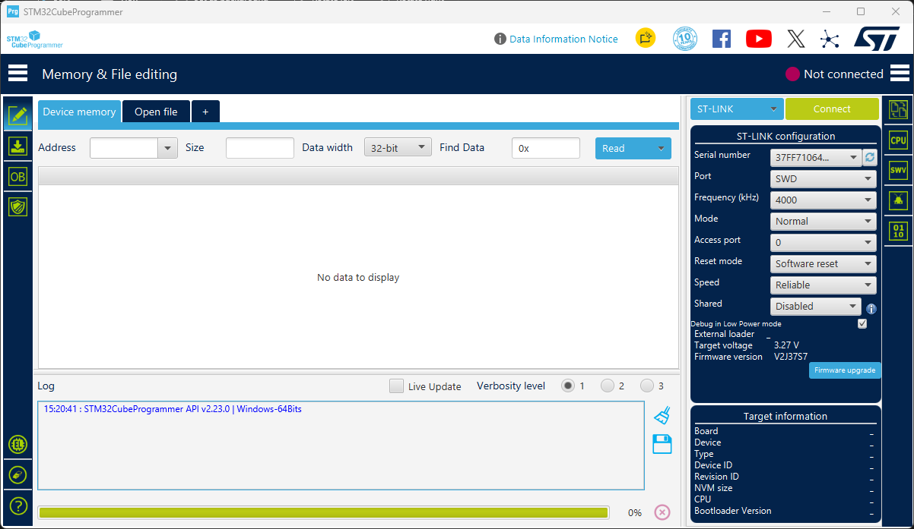
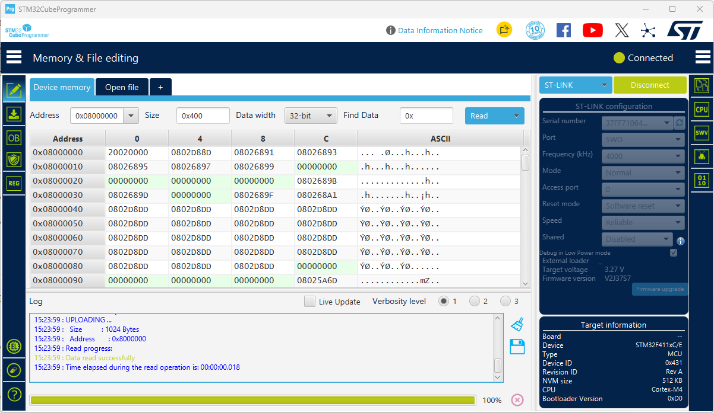
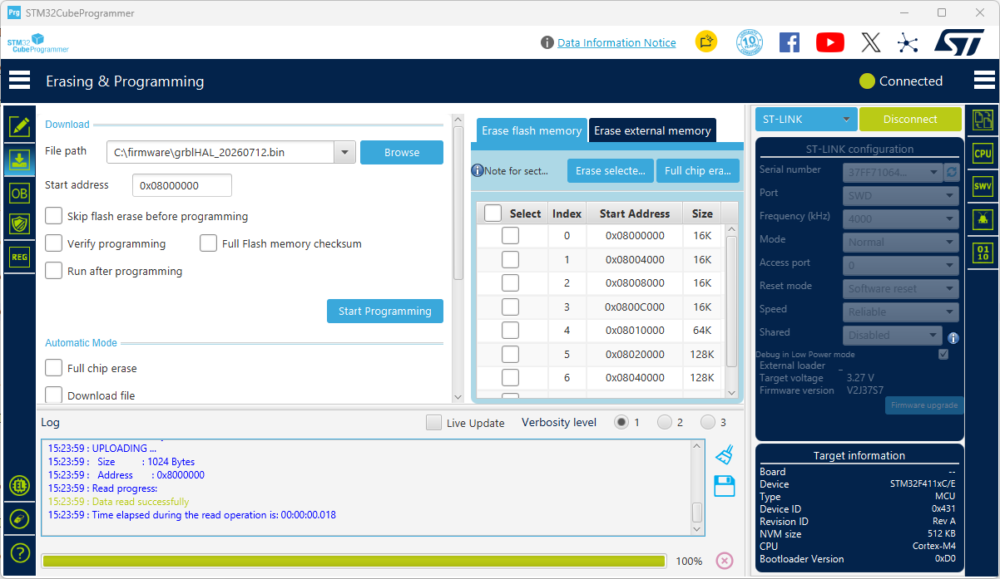
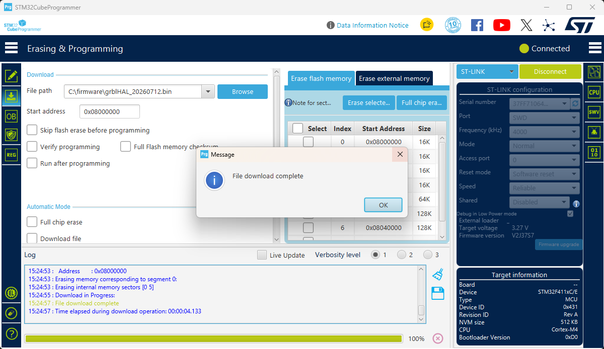
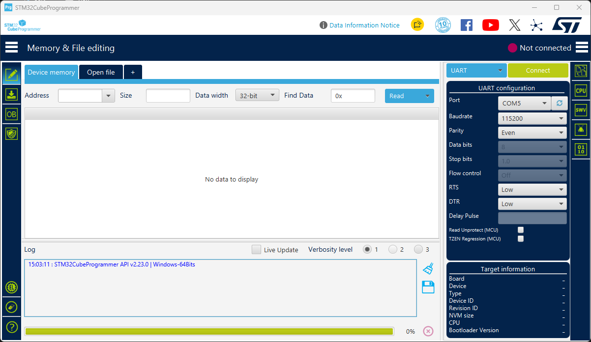
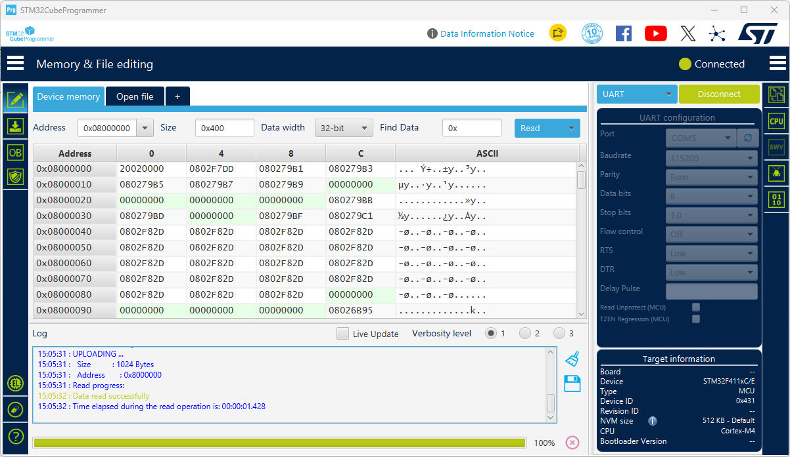
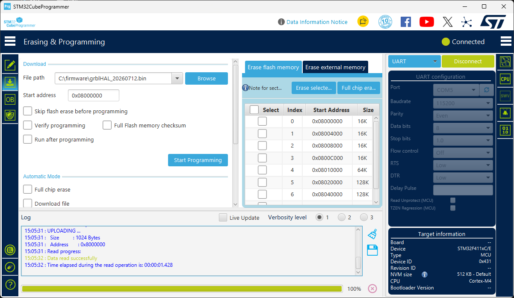
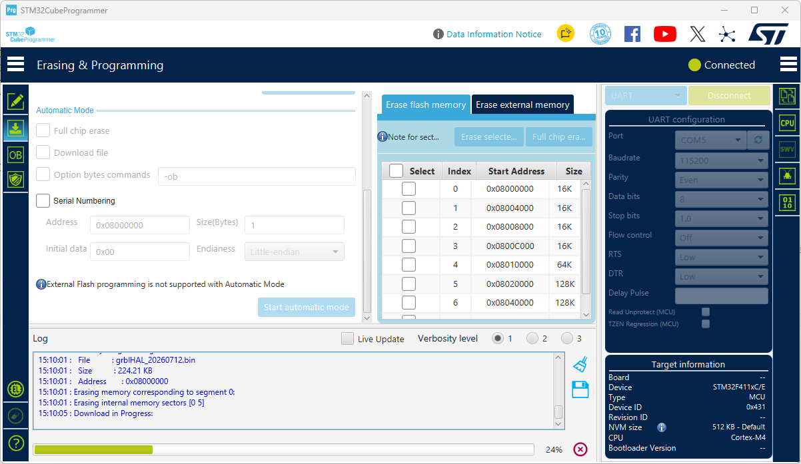

# Flashing the Firmware

The board can be programmed using either:

- **ST-LINK**
- **UART (STM32 Bootloader)**

The firmware source code is available in the official **grblHAL** repository for STM32F411:

https://github.com/grblHAL/STM32F4xx

For convenience, this repository also includes a **precompiled binary** in this directory, ready to be flashed to the board.

## ST-LINK Programming

1. Download and install **STM32CubeProgrammer** from the STMicroelectronics website:

   https://www.st.com/en/development-tools/stm32cubeprog.html

2. Connect the following signals to connector **P201**:
   - **SWDIO**
   - **SWCLK**
   - **GND**
   - **3.3V**

3. Open **STM32CubeProgrammer**, select **ST-LINK** as the connection interface, configure the connection parameters as shown below, and click **Connect**.

   

4. If the connection is successful, the microcontroller information will be displayed in the lower-right corner of the window.

   

5. In the left panel, select **Erasing & Programming**. Then select the firmware **.bin** file and click **Start Programming**.

   

6. Wait for the programming process to complete. When the **"File download complete"** message appears, the firmware has been successfully programmed.

   

You can now disconnect the ST-LINK programmer and reset or power cycle the board to start the new firmware.

## UART Programming (Bootloader Mode)

1. Download and install **STM32CubeProgrammer** from the STMicroelectronics website:

   https://www.st.com/en/development-tools/stm32cubeprog.html

2. Connect the following signals to connector **P200**:
   - **TX**
   - **RX**
   - **VCC**
   - **GND**

3. Put the microcontroller into **Bootloader Mode**:
   1. Press and hold the **NRST** button.
   2. Press and hold the **BOOT** button.
   3. Release the **NRST** button.
   4. Release the **BOOT** button.

4. Open **STM32CubeProgrammer**, configure the connection as shown below, and click **Connect**.

   

5. If the connection is successful, the microcontroller information will be displayed in the lower-right corner of the window.

   

6. In the left panel, select the **Erasing & Programming** tab. Browse for the firmware **.bin** file and click **Start Programming**.

   

7. Wait for the programming process to complete.

   

8. When the message **"File download complete"** appears, the firmware has been successfully programmed.

   

You can now disconnect the board from **STM32CubeProgrammer** and reset or power-cycle the microcontroller to start the new firmware.

# grblHAL Configuration

After flashing the firmware, configure the following parameters:

| Parameter | Value | Description |
|-----------|:-----:|-------------|
| `$5` | `0` | Sets the limit switches as **active-high**. |
| `$21` | `1` | Enables the physical limit switches. When triggered, grblHAL enters the alarm state and immediately stops all motion. |
| `$6` | `0` | Sets the **probe** input as **active-high**. |
